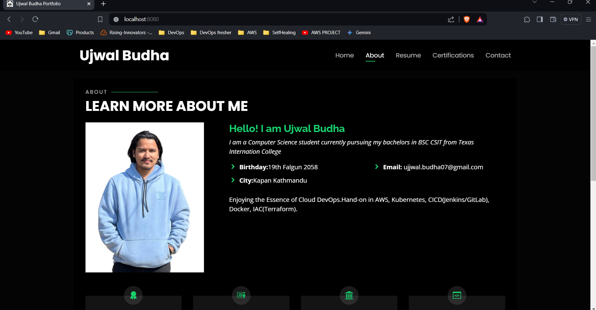

## Web Server

## Usage

1. Clone Repository: Clone this repository to your local machine.
```git clone <repository_url>```
2. Navigate to Project Directory: Go to the directory where the project is cloned.
```cd <project_directory>```
3. Run the Server: Execute the Go program to start the web server.
```go run main.go```
  Alternatively, you can build and run the executable file.
```go build main.go```
```./main```




This is a screenshot of my portfolio hosted using the application.
